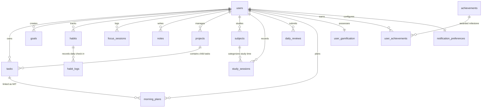

# DATABASE DESIGN & SCHEMA SPECIFICATION
## Personal Productivity App (Productivity Hub)

---

### 1. Database Overview

- **Database Management System**: MySQL 8.0 / MariaDB 10.5+
- **Database Name**: `productivity_app`
- **Default Storage Engine**: `InnoDB` (ACID compliant, transaction support, foreign key constraints)
- **Default Character Set**: `utf8mb4`
- **Default Collation**: `utf8mb4_unicode_ci` (Full Unicode multilingual support including emojis)
- **Total Tables**: 16 Normalized Relational Tables

---

### 2. Entity-Relationship (ER) Diagram

---

### 3. Detailed Table Specifications

#### 3.1 Table: `users`
Stores user authentication identities, credentials, and profile attributes.

| Column | Data Type | Nullable | Default | Constraints & Description |
|---|---|---|---|---|
| `id` | VARCHAR(36) | NO | — | **PRIMARY KEY** (UUID v4) |
| `name` | VARCHAR(100) | NO | — | User's full display name |
| `email` | VARCHAR(255) | NO | — | **UNIQUE KEY** (`uk_users_email`), user login email |
| `password_hash` | VARCHAR(255) | NO | — | Salted bcrypt password hash |
| `avatar` | VARCHAR(500) | YES | NULL | Profile image URL or avatar identifier |
| `created_at` | TIMESTAMP | NO | CURRENT_TIMESTAMP | Account creation timestamp |
| `updated_at` | TIMESTAMP | NO | CURRENT_TIMESTAMP ON UPDATE | Account update timestamp |

---

#### 3.2 Table: `tasks`
Stores individual actionable work items.

| Column | Data Type | Nullable | Default | Constraints & Description |
|---|---|---|---|---|
| `id` | VARCHAR(36) | NO | — | **PRIMARY KEY** (UUID v4) |
| `user_id` | VARCHAR(36) | NO | — | **FOREIGN KEY** &rarr; `users(id)` ON DELETE CASCADE |
| `project_id` | VARCHAR(36) | YES | NULL | **FOREIGN KEY** &rarr; `projects(id)` ON DELETE SET NULL |
| `title` | VARCHAR(255) | NO | — | Task title |
| `description` | TEXT | YES | NULL | Extended task details |
| `priority` | ENUM('low','medium','high') | NO | 'medium' | Priority level |
| `status` | ENUM('todo','in_progress','completed') | NO | 'todo' | Current status |
| `category` | VARCHAR(50) | YES | 'General' | Category tag |
| `due_date` | DATE | YES | NULL | Scheduled completion date |
| `due_time` | TIME | YES | NULL | Scheduled completion time |
| `estimated_minutes` | INT UNSIGNED | YES | NULL | Estimated effort duration |
| `created_at` | TIMESTAMP | NO | CURRENT_TIMESTAMP | Creation timestamp |
| `updated_at` | TIMESTAMP | NO | CURRENT_TIMESTAMP ON UPDATE | Update timestamp |
| `completed_at` | TIMESTAMP | YES | NULL | Timestamp when marked completed |

*Indexes*: `idx_tasks_user_id`, `idx_tasks_user_status`, `idx_tasks_user_due_date`, `idx_tasks_user_priority`.

---

#### 3.3 Table: `goals`
Stores high-level, long-term strategic milestones.

| Column | Data Type | Nullable | Default | Constraints & Description |
|---|---|---|---|---|
| `id` | VARCHAR(36) | NO | — | **PRIMARY KEY** (UUID v4) |
| `user_id` | VARCHAR(36) | NO | — | **FOREIGN KEY** &rarr; `users(id)` ON DELETE CASCADE |
| `title` | VARCHAR(255) | NO | — | Goal objective |
| `description` | TEXT | YES | NULL | Strategy description |
| `category` | VARCHAR(50) | YES | 'General' | Domain category |
| `priority` | ENUM('low','medium','high') | NO | 'medium' | Priority level |
| `status` | ENUM('active','completed','paused') | NO | 'active' | Lifecycle status |
| `progress` | INT | NO | 0 | Progress percentage (0–100) |
| `start_date` | DATE | YES | NULL | Goal initiation date |
| `target_date` | DATE | YES | NULL | Target deadline |
| `created_at` | TIMESTAMP | NO | CURRENT_TIMESTAMP | Creation timestamp |
| `updated_at` | TIMESTAMP | NO | CURRENT_TIMESTAMP ON UPDATE | Update timestamp |
| `completed_at` | TIMESTAMP | YES | NULL | Completion timestamp |

---

#### 3.4 Table: `habits`
Defines recurring daily or weekly routine habits.

| Column | Data Type | Nullable | Default | Constraints & Description |
|---|---|---|---|---|
| `id` | VARCHAR(36) | NO | — | **PRIMARY KEY** (UUID v4) |
| `user_id` | VARCHAR(36) | NO | — | **FOREIGN KEY** &rarr; `users(id)` ON DELETE CASCADE |
| `name` | VARCHAR(255) | NO | — | Habit routine name |
| `description` | TEXT | YES | NULL | Routine details |
| `category` | VARCHAR(50) | YES | 'General' | Category tag |
| `frequency` | ENUM('daily','weekly') | NO | 'daily' | Frequency schedule |
| `target_count` | INT | NO | 1 | Target completions per interval |
| `color` | VARCHAR(50) | YES | 'emerald' | UI accent color |
| `icon` | VARCHAR(50) | YES | 'Repeat' | Lucide icon identifier |
| `active` | BOOLEAN | NO | TRUE | Active status flag |
| `created_at` | TIMESTAMP | NO | CURRENT_TIMESTAMP | Creation timestamp |
| `updated_at` | TIMESTAMP | NO | CURRENT_TIMESTAMP ON UPDATE | Update timestamp |

---

#### 3.5 Table: `habit_logs`
Records discrete daily completions of habits.

| Column | Data Type | Nullable | Default | Constraints & Description |
|---|---|---|---|---|
| `id` | VARCHAR(36) | NO | — | **PRIMARY KEY** (UUID v4) |
| `habit_id` | VARCHAR(36) | NO | — | **FOREIGN KEY** &rarr; `habits(id)` ON DELETE CASCADE |
| `user_id` | VARCHAR(36) | NO | — | **FOREIGN KEY** &rarr; `users(id)` ON DELETE CASCADE |
| `log_date` | DATE | NO | — | Date of habit execution |
| `completed` | BOOLEAN | NO | TRUE | Completion indicator |
| `completed_at` | TIMESTAMP | NO | CURRENT_TIMESTAMP | Timestamp of completion |

*Unique Constraint*: `UNIQUE KEY uk_habit_log_date (habit_id, log_date)` prevents duplicate check-ins on the same day.

---

#### 3.6 Table: `focus_sessions`
Tracks Pomodoro intervals and deep work sessions.

| Column | Data Type | Nullable | Default | Constraints & Description |
|---|---|---|---|---|
| `id` | VARCHAR(36) | NO | — | **PRIMARY KEY** (UUID v4) |
| `user_id` | VARCHAR(36) | NO | — | **FOREIGN KEY** &rarr; `users(id)` ON DELETE CASCADE |
| `task_id` | VARCHAR(36) | YES | NULL | **FOREIGN KEY** &rarr; `tasks(id)` ON DELETE SET NULL |
| `mode` | ENUM('focus','short_break','long_break') | NO | 'focus' | Timer interval mode |
| `planned_minutes` | INT | NO | 25 | Planned duration |
| `actual_minutes` | INT | NO | 25 | Elapsed duration logged |
| `started_at` | TIMESTAMP | NO | CURRENT_TIMESTAMP | Interval start timestamp |
| `ended_at` | TIMESTAMP | NO | CURRENT_TIMESTAMP | Interval end timestamp |
| `completed` | BOOLEAN | NO | TRUE | Session finished flag |
| `created_at` | TIMESTAMP | NO | CURRENT_TIMESTAMP | Record creation timestamp |

---

#### 3.7 Table: `notes`
Stores categorized notes with Markdown formatting.

| Column | Data Type | Nullable | Default | Constraints & Description |
|---|---|---|---|---|
| `id` | VARCHAR(36) | NO | — | **PRIMARY KEY** (UUID v4) |
| `user_id` | VARCHAR(36) | NO | — | **FOREIGN KEY** &rarr; `users(id)` ON DELETE CASCADE |
| `title` | VARCHAR(255) | NO | 'Untitled Note' | Note title |
| `content` | MEDIUMTEXT | YES | NULL | Markdown content |
| `category` | VARCHAR(50) | YES | 'General' | Note category |
| `is_pinned` | BOOLEAN | NO | FALSE | Pinned to top flag |
| `created_at` | TIMESTAMP | NO | CURRENT_TIMESTAMP | Creation timestamp |
| `updated_at` | TIMESTAMP | NO | CURRENT_TIMESTAMP ON UPDATE | Update timestamp |

---

#### 3.8 Table: `projects`
Groups related deliverables and aggregates child task completion.

| Column | Data Type | Nullable | Default | Constraints & Description |
|---|---|---|---|---|
| `id` | VARCHAR(36) | NO | — | **PRIMARY KEY** (UUID v4) |
| `user_id` | VARCHAR(36) | NO | — | **FOREIGN KEY** &rarr; `users(id)` ON DELETE CASCADE |
| `name` | VARCHAR(255) | NO | — | Project title |
| `description` | TEXT | YES | NULL | Project scope |
| `status` | ENUM('planning','active','completed','archived') | NO | 'planning' | Project status |
| `priority` | ENUM('low','medium','high') | NO | 'medium' | Priority level |
| `start_date` | DATE | YES | NULL | Project start date |
| `due_date` | DATE | YES | NULL | Project deadline |
| `color` | VARCHAR(50) | YES | 'indigo' | UI color theme |
| `created_at` | TIMESTAMP | NO | CURRENT_TIMESTAMP | Creation timestamp |
| `updated_at` | TIMESTAMP | NO | CURRENT_TIMESTAMP ON UPDATE | Update timestamp |

---

#### 3.9 Table: `subjects`
Maintains academic courses or self-study subjects.

| Column | Data Type | Nullable | Default | Constraints & Description |
|---|---|---|---|---|
| `id` | VARCHAR(36) | NO | — | **PRIMARY KEY** (UUID v4) |
| `user_id` | VARCHAR(36) | NO | — | **FOREIGN KEY** &rarr; `users(id)` ON DELETE CASCADE |
| `name` | VARCHAR(255) | NO | — | Subject or course title |
| `code` | VARCHAR(50) | YES | NULL | Course code (e.g., CS702) |
| `color` | VARCHAR(50) | YES | 'blue' | Badge color |
| `target_hours` | DECIMAL(6,2) | NO | 0.00 | Semester target hours |
| `created_at` | TIMESTAMP | NO | CURRENT_TIMESTAMP | Creation timestamp |
| `updated_at` | TIMESTAMP | NO | CURRENT_TIMESTAMP ON UPDATE | Update timestamp |

---

#### 3.10 Table: `study_sessions`
Logs structured academic study intervals.

| Column | Data Type | Nullable | Default | Constraints & Description |
|---|---|---|---|---|
| `id` | VARCHAR(36) | NO | — | **PRIMARY KEY** (UUID v4) |
| `user_id` | VARCHAR(36) | NO | — | **FOREIGN KEY** &rarr; `users(id)` ON DELETE CASCADE |
| `subject_id` | VARCHAR(36) | NO | — | **FOREIGN KEY** &rarr; `subjects(id)` ON DELETE CASCADE |
| `title` | VARCHAR(255) | NO | — | Study topic or chapter |
| `date` | DATE | NO | — | Study date |
| `start_time` | TIME | NO | — | Start time |
| `end_time` | TIME | NO | — | End time |
| `duration_minutes` | INT UNSIGNED | NO | — | Calculated study duration |
| `notes` | TEXT | YES | NULL | Study notes or takeaways |
| `created_at` | TIMESTAMP | NO | CURRENT_TIMESTAMP | Creation timestamp |

---

#### 3.11 Table: `daily_reviews`
Captures end-of-day introspection and ratings.

| Column | Data Type | Nullable | Default | Constraints & Description |
|---|---|---|---|---|
| `id` | VARCHAR(36) | NO | — | **PRIMARY KEY** (UUID v4) |
| `user_id` | VARCHAR(36) | NO | — | **FOREIGN KEY** &rarr; `users(id)` ON DELETE CASCADE |
| `review_date` | DATE | NO | — | Date of review |
| `what_went_well` | TEXT | YES | NULL | Daily achievements |
| `challenges` | TEXT | YES | NULL | Obstacles faced |
| `learned` | TEXT | YES | NULL | Key learnings |
| `improvements` | TEXT | YES | NULL | Calibration for tomorrow |
| `mood` | ENUM('great','good','okay','difficult','bad') | NO | 'good' | Sentiment rating |
| `rating` | TINYINT UNSIGNED | NO | 3 | Overall score (1–5) |
| `created_at` | TIMESTAMP | NO | CURRENT_TIMESTAMP | Creation timestamp |
| `updated_at` | TIMESTAMP | NO | CURRENT_TIMESTAMP ON UPDATE | Update timestamp |

*Unique Constraint*: `UNIQUE KEY uk_daily_reviews_user_date (user_id, review_date)` enforces one review per user per calendar day.

---

#### 3.12 Table: `morning_plans`
Captures morning intentions and Most Important Tasks (MIT).

| Column | Data Type | Nullable | Default | Constraints & Description |
|---|---|---|---|---|
| `id` | VARCHAR(36) | NO | — | **PRIMARY KEY** (UUID v4) |
| `user_id` | VARCHAR(36) | NO | — | **FOREIGN KEY** &rarr; `users(id)` ON DELETE CASCADE |
| `plan_date` | DATE | NO | — | Date of plan |
| `priority_1` | VARCHAR(255) | NO | — | Most Important Task #1 |
| `priority_2` | VARCHAR(255) | YES | NULL | Most Important Task #2 |
| `priority_3` | VARCHAR(255) | YES | NULL | Most Important Task #3 |
| `priority_1_task_id` | VARCHAR(36) | YES | NULL | **FOREIGN KEY** &rarr; `tasks(id)` ON DELETE SET NULL |
| `priority_2_task_id` | VARCHAR(36) | YES | NULL | **FOREIGN KEY** &rarr; `tasks(id)` ON DELETE SET NULL |
| `priority_3_task_id` | VARCHAR(36) | YES | NULL | **FOREIGN KEY** &rarr; `tasks(id)` ON DELETE SET NULL |
| `planned_study_minutes` | INT UNSIGNED | NO | 0 | Planned study target |
| `planned_focus_minutes` | INT UNSIGNED | NO | 0 | Planned focus target |
| `notes` | TEXT | YES | NULL | General planning notes |
| `intention` | TEXT | YES | NULL | Daily guiding intention |
| `created_at` | TIMESTAMP | NO | CURRENT_TIMESTAMP | Creation timestamp |
| `updated_at` | TIMESTAMP | NO | CURRENT_TIMESTAMP ON UPDATE | Update timestamp |

*Unique Constraint*: `UNIQUE KEY uk_morning_plans_user_date (user_id, plan_date)` guarantees one plan per day.

---

#### 3.13 Table: `user_gamification`
Tracks user experience points, level, and cumulative statistics.

| Column | Data Type | Nullable | Default | Constraints & Description |
|---|---|---|---|---|
| `user_id` | VARCHAR(36) | NO | — | **PRIMARY KEY** & **FOREIGN KEY** &rarr; `users(id)` ON DELETE CASCADE |
| `xp` | INT UNSIGNED | NO | 0 | Total accumulated XP |
| `level` | INT UNSIGNED | NO | 1 | Calculated user level |
| `total_completed_tasks`| INT UNSIGNED | NO | 0 | All-time tasks completed |
| `total_focus_minutes` | INT UNSIGNED | NO | 0 | All-time focus minutes |
| `total_study_minutes` | INT UNSIGNED | NO | 0 | All-time study minutes |
| `current_streak` | INT UNSIGNED | NO | 0 | Active consecutive day streak |
| `longest_streak` | INT UNSIGNED | NO | 0 | All-time highest streak |
| `created_at` | TIMESTAMP | NO | CURRENT_TIMESTAMP | Creation timestamp |
| `updated_at` | TIMESTAMP | NO | CURRENT_TIMESTAMP ON UPDATE | Update timestamp |

---

#### 3.14 Table: `achievements`
System-wide master catalog of 12 unlockable milestones.

| Column | Data Type | Nullable | Default | Constraints & Description |
|---|---|---|---|---|
| `id` | VARCHAR(36) | NO | — | **PRIMARY KEY** (UUID v4) |
| `code` | VARCHAR(50) | NO | — | **UNIQUE KEY** (`uk_achievements_code`), code identifier |
| `name` | VARCHAR(100) | NO | — | Milestone title |
| `description` | VARCHAR(255) | NO | — | Unlock criteria |
| `icon` | VARCHAR(50) | NO | — | Lucide icon name |
| `category` | VARCHAR(50) | NO | 'general' | Category (tasks, focus, study, consistency) |
| `xp_reward` | INT UNSIGNED | NO | 20 | Bonus XP awarded upon unlock |
| `created_at` | TIMESTAMP | NO | CURRENT_TIMESTAMP | Seed timestamp |

---

#### 3.15 Table: `user_achievements`
Associates earned milestones with users.

| Column | Data Type | Nullable | Default | Constraints & Description |
|---|---|---|---|---|
| `id` | VARCHAR(36) | NO | — | **PRIMARY KEY** (UUID v4) |
| `user_id` | VARCHAR(36) | NO | — | **FOREIGN KEY** &rarr; `users(id)` ON DELETE CASCADE |
| `achievement_id` | VARCHAR(36) | NO | — | **FOREIGN KEY** &rarr; `achievements(id)` ON DELETE CASCADE |
| `earned_at` | TIMESTAMP | NO | CURRENT_TIMESTAMP | Timestamp when unlocked |

*Unique Constraint*: `UNIQUE KEY uk_user_achievement (user_id, achievement_id)` guarantees each achievement can only be unlocked once per user.

---

#### 3.16 Table: `notification_preferences`
Maintains user-configured alert and notification toggles.

| Column | Data Type | Nullable | Default | Constraints & Description |
|---|---|---|---|---|
| `user_id` | VARCHAR(36) | NO | — | **PRIMARY KEY** & **FOREIGN KEY** &rarr; `users(id)` ON DELETE CASCADE |
| `enabled` | BOOLEAN | NO | FALSE | Master notification switch |
| `morning_plan_enabled` | BOOLEAN | NO | TRUE | Morning plan reminder toggle |
| `habit_enabled` | BOOLEAN | NO | TRUE | Habit reminder toggle |
| `study_enabled` | BOOLEAN | NO | TRUE | Study reminder toggle |
| `focus_enabled` | BOOLEAN | NO | TRUE | Focus interval chime toggle |
| `daily_review_enabled` | BOOLEAN | NO | TRUE | Evening review reminder toggle |
| `updated_at` | TIMESTAMP | NO | CURRENT_TIMESTAMP ON UPDATE | Update timestamp |
