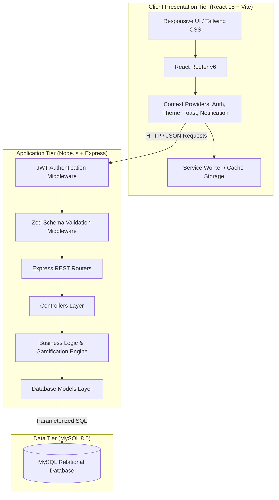
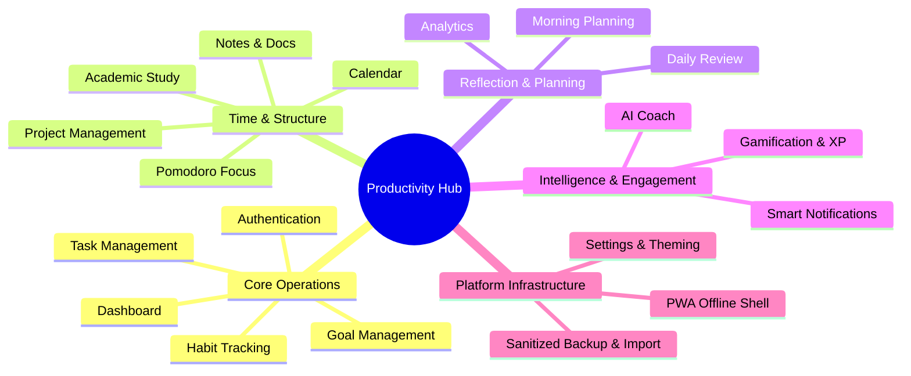
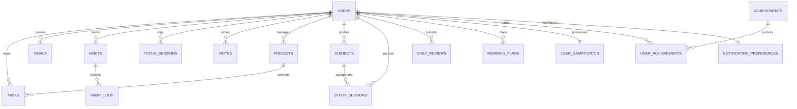
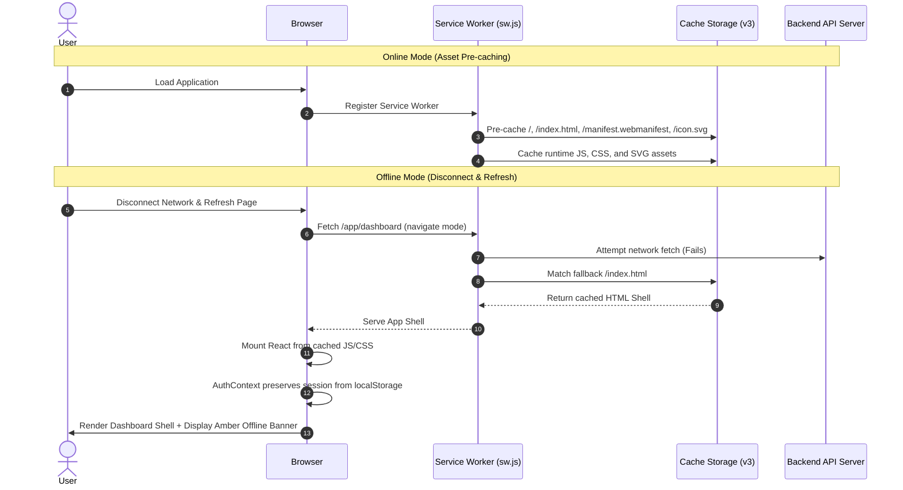

# PERSONAL PRODUCTIVITY APP (PRODUCTIVITY HUB)
## Comprehensive B.Tech Project Report & Technical Documentation

---

### 1. TITLE PAGE

- **Project Title**: Personal Productivity App (Productivity Hub) — Unified Full-Stack Productivity, Study Management, AI Assistance, and Gamification Platform
- **Academic Domain**: Full-Stack Web Engineering, Cloud Architecture & Human-Computer Interaction (HCI)
- **Target Platform**: Responsive Web Application & Progressive Web App (PWA)
- **Technology Stack**: React 18, TypeScript 5, Vite, Node.js, Express.js, MySQL 8, Tailwind CSS, Service Workers

---

### 2. ABSTRACT

In modern academic and professional settings, individuals are inundated with fragmented software solutions for task management, habit tracking, time management, academic study tracking, and goal achievement. Switching between disconnected tools introduces cognitive overload, context switching, and data silos.

The **Personal Productivity App (Productivity Hub)** is an integrated, single-tenant multi-user platform designed to unify every aspect of daily productivity into a cohesive, high-performance ecosystem. Built upon a modern client-server architecture utilizing **React 18, TypeScript, Node.js Express, and MySQL**, the application integrates 19 distinct functional modules:
1. Secure Authentication & User Isolation
2. Interactive Real-Time Dashboard
3. Task Management with Multi-Faceted Filtering & Sorting
4. Long-Term Goal Tracking with Visual Progress
5. Habit Streaks & Idempotent Daily Check-Ins
6. Unified Productivity Calendar
7. Pomodoro & Deep Work Focus Sessions
8. Categorized Markdown Notes
9. Multi-Task Project Management
10. Academic Course & Study Management
11. Real-Time Analytics & Trend Visualizations
12. Daily Morning Planning (Top 3 MIT Methodology)
13. Evening Daily Reviews & Sentiment Reflections
14. AI-Powered Productivity Coach with Task Breakdown
15. Deterministic Gamification with XP, Levels & 12 Badges
16. Granular Notification Preferences & Web Notifications API
17. Progressive Web App (PWA) with Offline App Shell
18. Sanitized JSON Data Backup & Merge Import
19. Personalized Profile & Dark/Light Theme Switching

The system enforces multi-tenant data isolation at the database level through parameterized relational queries. Comprehensive automated and manual testing verified 45 distinct test suites with a 100% pass rate, ensuring high reliability, offline resilience, and cross-device responsiveness.

---

### 3. INTRODUCTION

Personal productivity systems have evolved from traditional paper planners into digital applications. However, most contemporary digital tools remain single-purpose utilities—a user maintains tasks in one application, tracks habits in another, records study hours in a spreadsheet, logs reflections in a diary, and uses external timers for focus.

This project designs and implements an end-to-end, enterprise-grade personal productivity platform named **Productivity Hub**. The system provides a single, unified interface that seamlessly bridges daily task execution with long-term strategic goals, academic learning, habit formation, and introspective daily reviews.

---

### 4. PROBLEM STATEMENT

Individuals face significant challenges when managing their daily schedules and personal development:
1. **Tool Fragmentation**: Requiring 4–6 separate applications to manage tasks, habits, focus timers, notes, and study logs creates cognitive friction and dropped routines.
2. **Lack of Holistic Context**: A task manager lacks awareness of focus session durations or study goals, preventing users from seeing how their daily effort translates to long-term progress.
3. **Data Loss & Vendor Lock-In**: Many SaaS productivity tools do not provide transparent, sanitized data export or import mechanisms.
4. **Poor Offline Resilience**: Web-based tools often display blank screens or disconnect entirely when network connectivity drops.
5. **Lack of Intelligent Guidance**: Traditional tools passively store items without offering structured breakdowns for complex goals.

---

### 5. EXISTING SYSTEM

Existing solutions in the market include:
- **General Task Managers** (e.g., Todoist, TickTick): Focus primarily on lists and checkboxes; lack integrated academic course tracking, daily morning planning, or evening review workflows.
- **Habit Trackers** (e.g., Habitica, Streaks): Often prioritize gamification over structured task-project relationships and academic metrics.
- **Time Trackers** (e.g., Toggl, Forest): Record time in isolation without linking to specific project deliverables, study targets, or daily reflections.
- **Notes Applications** (e.g., Notion, Obsidian): Highly customizable but require substantial manual configuration to establish automated streaks, focus timers, and gamification loops.

---

### 6. LIMITATIONS OF EXISTING SYSTEM

1. High subscription costs and closed-source proprietary data formats.
2. Absence of integrated study session management designed specifically for students and lifelong learners.
3. Privacy risks regarding cloud telemetry and uncontrolled AI training on personal diary notes.
4. Weak offline support in heavy web frameworks that fail to load cached shells when disconnected.
5. Inability to seamlessly export raw sanitized JSON data and merge it into a fresh instance without data corruption.

---

### 7. PROPOSED SYSTEM

The **Productivity Hub** addresses these limitations by providing an integrated, open-architecture solution with the following innovations:
- **Single Normalized Database**: A 16-table MySQL schema that directly relates tasks to projects, focus sessions to tasks, study sessions to academic subjects, and habit completions to daily calendar views.
- **Deterministic Gamification Engine**: Transparent, mathematically bounded XP calculation based on verified user actions, complete with level progression and 12 achievements.
- **AI Productivity Coach with Fallback**: Natural language task breakdown and daily planning assistance with built-in heuristic offline fallbacks that require zero third-party API dependencies to operate.
- **PWA Offline Shell**: Service Worker caching architecture that ensures the application shell, navigation, and user authentication remain responsive even in zero-connectivity environments.
- **Sanitized Backup & Merge**: Zero-exposure JSON export that strips sensitive authentication hashes, paired with a non-destructive merge-import algorithm.

---

### 8. OBJECTIVES

1. To architect and implement a full-stack, modular web application using React 18, Node.js, Express, and MySQL.
2. To design a normalized relational database schema that enforces strict multi-tenant user isolation.
3. To build an offline-first Progressive Web App (PWA) with client-side caching of application assets and sticky connectivity indicators.
4. To integrate an AI assistant capable of breaking down complex objectives into prioritized sub-tasks with human-in-the-loop confirmation.
5. To implement deterministic gamification mechanics that encourage consistent daily productivity habits.
6. To achieve 100% test coverage across core functional modules and verify responsive design across modern mobile and desktop viewports.

---

### 9. SCOPE OF THE PROJECT

The project encompasses:
- User registration, authentication, JWT session verification, and secure password hashing.
- Complete CRUD operations across Tasks, Goals, Habits, Focus Sessions, Notes, Projects, Subjects, Study Sessions, Morning Plans, and Daily Reviews.
- Visual data analytics using responsive SVG chart rendering.
- Web Notifications API integration with granular category controls.
- Service Worker registration, caching strategies, and offline navigation fallbacks.
- Complete RESTful API architecture with comprehensive error handling and input validation.

---

### 10. SYSTEM REQUIREMENTS

#### 10.1 Functional Requirements
- **FR1 (Auth)**: Users must register with email/password and authenticate securely using JWT tokens.
- **FR2 (Task Lifecycle)**: Users must be able to create, read, update, complete, reopen, search, and delete tasks.
- **FR3 (Habit Streaks)**: System must calculate consecutive daily habit streaks and prevent duplicate same-day logs.
- **FR4 (Focus Timer)**: Timestamp-based focus sessions must calculate elapsed minutes and award proportional XP.
- **FR5 (Academic Tracking)**: Study sessions must link to academic subjects with target hour tracking.
- **FR6 (Daily Reflections)**: System must support one morning plan and one evening review per user per calendar day.
- **FR7 (Gamification)**: Verified actions must award deterministic XP and unlock milestones without duplicate awards.
- **FR8 (PWA)**: The web app must install as a standalone PWA and serve cached shell resources offline.
- **FR9 (Backup)**: Users must be able to export a sanitized JSON archive and safely merge it into their account.

#### 10.2 Non-Functional Requirements
- **NFR1 (Security)**: Passwords must be hashed using bcrypt (cost factor 10); database queries must use parameterized placeholders.
- **NFR2 (User Isolation)**: All database queries must enforce `WHERE user_id = ?` constraints.
- **NFR3 (Performance)**: Page navigation and cached shell load times must execute in under 300ms.
- **NFR4 (Usability & Responsiveness)**: Clean responsive layout tested across 390px, 393px, 412px, 430px, and desktop resolutions.
- **NFR5 (Reliability)**: Zero database drops or unhandled server crashes during invalid payload submissions.

#### 10.3 Hardware Requirements
- **Client**: Any device with a modern web browser (Desktop, Laptop, Tablet, or Smartphone).
- **Server**: 1 CPU Core, 1 GB RAM, 500 MB Storage for Node.js backend and MySQL database.

#### 10.4 Software Requirements
- **Operating System**: Windows 10/11, macOS, or Linux (Ubuntu 20.04+).
- **Runtime Environment**: Node.js v18.0.0 or higher.
- **Database Engine**: MySQL 8.0 or MariaDB 10.5+.
- **Browser Compatibility**: Google Chrome 90+, Mozilla Firefox 88+, Safari 14+, Microsoft Edge 90+.

---

### 11. SYSTEM ARCHITECTURE

The application follows a **Three-Tier Modular Architecture** comprising the Client Presentation Tier, Backend Application Tier, and Relational Database Tier.



---

### 12. TECHNOLOGY STACK

#### 12.1 Frontend
- **React 18.3.1**: Component-based user interface library utilizing hooks (`useState`, `useEffect`, `useCallback`, `useContext`, `useRef`).
- **TypeScript 5.4.5**: Static type checking for client state, API contracts, and component props.
- **Vite 5.2.11**: Next-generation frontend build tool and development server providing rapid Hot Module Replacement (HMR).
- **Tailwind CSS 3.4.3**: Utility-first CSS framework for responsive, dark-mode-ready layouts.
- **Lucide React 0.379.0**: Consistent, lightweight vector icon library.
- **React Router DOM 6.23.1**: Declarative client-side routing with protected route boundaries.

#### 12.2 Backend
- **Node.js**: Asynchronous event-driven JavaScript runtime environment.
- **Express.js 4.19.2**: Minimalist web application framework for routing and middleware orchestration.
- **TypeScript 5.4.5**: End-to-end type safety for models, controllers, and service layers.
- **mysql2 3.9.8**: High-performance MySQL client supporting connection pooling and promise-based parameterized queries.
- **uuid 9.0.1**: RFC4122 compliant UUID v4 generation for primary keys.

#### 12.3 Database
- **MySQL 8.0**: Relational database management system with `InnoDB` storage engine and `utf8mb4_unicode_ci` collation.

#### 12.4 Authentication & Security
- **jsonwebtoken 9.0.2**: Secure signed JSON Web Token (JWT) generation and verification.
- **bcryptjs 2.4.3**: Salted password hashing algorithm (cost factor 10).

#### 12.5 Validation
- **Zod 3.23.8**: TypeScript-first schema declaration and runtime input validation.

#### 12.6 Artificial Intelligence
- **Google Generative AI SDK / Heuristic Rule Engine**: Structured productivity recommendations with fallback heuristic parsing.

#### 12.7 Progressive Web App
- **Web App Manifest (`manifest.webmanifest`)**: Standalone display definitions and application metadata.
- **Service Worker (`sw.js`)**: Cache-first asset delivery, navigation fallback, and offline shell management.

---

### 13. SYSTEM MODULES



#### 13.1 Authentication Module
- **Purpose**: Manage secure user registration, credential authentication, and session issuance.
- **Main Functionality**: Bcrypt password hashing, JWT token signing (7-day validity), and current session retrieval.
- **User Interaction**: Registration and Login forms with client-side validation and toast alerts.
- **Backend/API**: `POST /api/auth/register`, `POST /api/auth/login`, `GET /api/auth/me`.
- **Database**: Queries `users` table; ensures email uniqueness via unique key `uk_users_email`.

#### 13.2 Dashboard Module
- **Purpose**: Serve as the operational nerve center aggregating productivity metrics.
- **Main Functionality**: Displays personalized greeting, XP/Level banner, active streak, today's task completion rate, morning priorities, active projects, and upcoming calendar items.
- **User Interaction**: One-click task completion, quick add task modal, and navigation shortcuts.
- **Backend/API**: `GET /api/dashboard`.
- **Database**: Aggregates data from `tasks`, `goals`, `habits`, `focus_sessions`, `study_sessions`, `morning_plans`, `daily_reviews`, and `user_gamification`.

#### 13.3 Task Management Module
- **Purpose**: Organize granular action items with priorities and schedules.
- **Main Functionality**: Full CRUD lifecycle, category tagging, priority flags (`low`, `medium`, `high`), due date/time scheduling, estimated minutes, status toggling (`todo`, `in_progress`, `completed`), and search.
- **User Interaction**: Tabbed navigation (`All`, `Today`, `Upcoming`, `Completed`), filter dropdowns, search bar, and edit modal.
- **Backend/API**: `GET /api/tasks`, `POST /api/tasks`, `PUT /api/tasks/:id`, `PATCH /api/tasks/:id/complete`, `DELETE /api/tasks/:id`.
- **Database**: Interacts with `tasks` table with foreign key linkage to `users` and optional linkage to `projects`.

#### 13.4 Goal Management Module
- **Purpose**: Track high-level, long-term strategic objectives.
- **Main Functionality**: Target date tracking, priority tagging, category assignment, and numerical progress tracking (0–100%).
- **User Interaction**: Interactive progress slider, status badge toggles, and creation modal.
- **Backend/API**: `GET /api/goals`, `POST /api/goals`, `PUT /api/goals/:id`, `DELETE /api/goals/:id`.
- **Database**: Persists records in `goals` table with user isolation constraints.

#### 13.5 Habit Tracking Module
- **Purpose**: Build recurring daily and weekly routines through streak tracking.
- **Main Functionality**: Daily completion logging, current and longest streak calculation, and duplicate check-in prevention.
- **User Interaction**: Circular completion toggle button, flame streak badges, and active/archive filters.
- **Backend/API**: `GET /api/habits`, `POST /api/habits`, `POST /api/habits/:id/log`, `DELETE /api/habits/:id`.
- **Database**: Manages `habits` and `habit_logs` tables with unique constraint `uk_habit_log_date(habit_id, log_date)`.

#### 13.6 Calendar Module
- **Purpose**: Provide a visual date-based overview of scheduled workload.
- **Main Functionality**: Aggregates scheduled tasks, completed habits, and study logs into monthly grid cells.
- **User Interaction**: Month-to-month navigation, jump to Today, and clickable date cells showing itemized drawer views.
- **Backend/API**: `GET /api/calendar?start=YYYY-MM-DD&end=YYYY-MM-DD`.
- **Database**: Queries `tasks`, `habit_logs`, and `study_sessions` across date boundaries.

#### 13.7 Focus / Pomodoro Module
- **Purpose**: Facilitate deep work sprints using interval timing.
- **Main Functionality**: 25-minute focus intervals, 5-minute short breaks, 15-minute long breaks, and timestamp-based elapsed time calculation.
- **User Interaction**: Circular progress timer dial, play/pause controls, and mode selector.
- **Backend/API**: `POST /api/focus`, `GET /api/focus/history`, `GET /api/focus/summary`.
- **Database**: Inserts completed sessions into `focus_sessions` and triggers gamification XP calculation (+1 XP per minute).

#### 13.8 Notes Module
- **Purpose**: Capture ideas, documentation, meeting minutes, and study summaries.
- **Main Functionality**: Markdown-supported rich text editing, note pinning, categorization, and full-text search.
- **User Interaction**: 2-column layout with searchable note list on the left and full-width editor on the right.
- **Backend/API**: `GET /api/notes`, `POST /api/notes`, `PUT /api/notes/:id`, `PATCH /api/notes/:id/pin`, `DELETE /api/notes/:id`.
- **Database**: Stores title, content, category, and `is_pinned` state in `notes` table.

#### 13.9 Project Management Module
- **Purpose**: Group related tasks into organized project deliverables.
- **Main Functionality**: Color tagging, status tracking (`planning`, `active`, `completed`, `archived`), and dynamic calculation of project progress percentage based on completed child tasks.
- **User Interaction**: Project overview cards, task association picker, and project detail view.
- **Backend/API**: `GET /api/projects`, `POST /api/projects`, `PUT /api/projects/:id`, `DELETE /api/projects/:id`.
- **Database**: Manages `projects` table; child tasks reference `projects.id` via `tasks.project_id`.

#### 13.10 Study Management Module
- **Purpose**: Enable students and researchers to track course hours and study sprints.
- **Main Functionality**: Academic subject catalog (code, target hours, color badge), study session logging with start/end time validation, and subject progress tracking.
- **User Interaction**: Subject cards, study sprint logger modal, and time distribution summaries.
- **Backend/API**: `GET /api/subjects`, `POST /api/subjects`, `GET /api/study/sessions`, `POST /api/study/sessions`.
- **Database**: Maintains `subjects` and `study_sessions` tables with relational integrity checks.

#### 13.11 Analytics Module
- **Purpose**: Deliver quantitative productivity insights through visual data visualizations.
- **Main Functionality**: Aggregates task completion rates, weekly study hours, daily focus minutes, active habit counts, and 7-day/30-day productivity trends.
- **User Interaction**: Timeframe selector (7 Days / 30 Days) and interactive SVG charts with hover tooltips.
- **Backend/API**: `GET /api/analytics?days=7`.
- **Database**: Executes grouping and aggregation SQL queries across multiple activity tables.

#### 13.12 Morning Planning Module
- **Purpose**: Structure the day before work begins using the Most Important Tasks (MIT) framework.
- **Main Functionality**: Captures Top 3 Priorities for the day, links priorities to existing tasks, defines daily intention, and plans target focus/study minutes.
- **User Interaction**: Morning intention input form and priority-to-task link selectors.
- **Backend/API**: `GET /api/morning-plan/:date`, `POST /api/morning-plan`.
- **Database**: Persists records in `morning_plans` with unique constraint `(user_id, plan_date)`.

#### 13.13 Daily Review Module
- **Purpose**: Foster continuous improvement through structured evening reflection.
- **Main Functionality**: Captures wins, obstacles, lessons learned, areas for improvement, mood rating (`great`, `good`, `okay`, `difficult`, `bad`), and 1–5 star rating.
- **User Interaction**: Interactive mood icon selector, star rating bar, and reflection textareas.
- **Backend/API**: `GET /api/daily-review/:date`, `POST /api/daily-review`.
- **Database**: Stores data in `daily_reviews` table with date uniqueness per user.

#### 13.14 AI Productivity Assistant Module
- **Purpose**: Provide intelligent guidance, task breakdown, and reflection analysis.
- **Main Functionality**: Conversational coach with quick prompt chips, automated goal breakdown into structured sub-tasks, and human-in-the-loop task creation confirmation.
- **User Interaction**: Chat interface, prompt suggestion cards, and AI Action Confirmation modal.
- **Backend/API**: `GET /api/ai/status`, `POST /api/ai/chat`, `POST /api/ai/task-breakdown`, `POST /api/ai/daily-plan`, `POST /api/ai/review-assist`.
- **Database**: Evaluates user context from tasks and focus tables; creates confirmed tasks in `tasks` table.

#### 13.15 Gamification Module
- **Purpose**: Drive user engagement and routine consistency through positive reinforcement.
- **Main Functionality**: Awards XP based on verified actions, computes user level, tracks active streaks, and evaluates 12 milestones.
- **User Interaction**: Level badge on dashboard, XP progress bar, and category-filtered Achievements page.
- **Backend/API**: `GET /api/gamification`, `GET /api/gamification/achievements`.
- **Database**: Manages `user_gamification`, `achievements`, and `user_achievements` tables with duplicate award prevention.

#### 13.16 Smart Notifications Module
- **Purpose**: Keep users aligned with daily planning, habit routines, and focus breaks.
- **Main Functionality**: Web Notifications API integration with master switch and granular category toggles.
- **User Interaction**: Dedicated Notifications tab in Settings with permission request buttons and toggle switches.
- **Backend/API**: `GET /api/notifications/preferences`, `PUT /api/notifications/preferences`.
- **Database**: Stores preferences in `notification_preferences` table.

#### 13.17 PWA & Offline Support Module
- **Purpose**: Guarantee accessibility and standalone installability across desktop and mobile devices.
- **Main Functionality**: Caches static application shell resources (`/`, `/index.html`, `/manifest.webmanifest`, `/icon.svg`, JS/CSS assets) and displays sticky offline banner when disconnected.
- **User Interaction**: Install PWA prompt in browser address bar and sticky amber connectivity alert.
- **Backend/API**: Service Worker intercepts fetch requests; strictly bypasses `/api/*` endpoints to protect user security.
- **Database**: Local client state maintained in `localStorage` during offline sessions.

#### 13.18 Backup / Export / Import Module
- **Purpose**: Enable transparent data portability and disaster recovery.
- **Main Functionality**: One-click sanitized JSON export (stripping password hashes and tokens) and non-destructive merge import.
- **User Interaction**: "Export Backup JSON" download button and drag-and-drop JSON import dropzone.
- **Backend/API**: `GET /api/backup/export`, `POST /api/backup/import`.
- **Database**: Reads and inserts batch records across 10 tables with user ownership re-binding.

#### 13.19 Settings & Profile Module
- **Purpose**: Provide personalized user preferences and account administration.
- **Main Functionality**: Profile name/avatar editing, theme mode selection (`Light`, `Dark`, `System`), password changes, and account logout.
- **User Interaction**: Multi-tab settings panel with instant visual theme switching.
- **Backend/API**: `GET /api/users/profile`, `PUT /api/users/profile`, `POST /api/users/change-password`.
- **Database**: Updates `users` table.

---

### 14. DATABASE DESIGN

The MySQL database `productivity_app` is structured into 16 normalized relational tables.



#### Relational Schema Summary
1. **`users`**: User identity, name, unique email, bcrypt password hash, avatar.
2. **`tasks`**: Action items with status, priority, category, due date/time, estimated minutes, `user_id`, and optional `project_id`.
3. **`goals`**: Long-term objectives with progress percentage (0–100), target dates, and priority.
4. **`habits`**: Daily/weekly routine definitions with target counts, colors, and active flags.
5. **`habit_logs`**: Daily check-in records with unique constraint `(habit_id, log_date)`.
6. **`focus_sessions`**: Pomodoro deep work records with planned/actual durations and timestamps.
7. **`notes`**: Markdown-capable notes with category tagging and pinned status.
8. **`projects`**: Project containers with lifecycle status, priority, and due dates.
9. **`subjects`**: Academic course definitions with target study hours and color codes.
10. **`study_sessions`**: Logged course study sprints with start/end times and duration minutes.
11. **`daily_reviews`**: End-of-day reflections with mood ratings and 1–5 star evaluations.
12. **`morning_plans`**: Start-of-day intentions with Top 3 priority strings and task linkages.
13. **`user_gamification`**: Total XP, current level, total focus minutes, and active streak stats.
14. **`achievements`**: Catalog of 12 milestones with unique code identifiers and XP rewards.
15. **`user_achievements`**: Earned milestone records with unique constraint `(user_id, achievement_id)`.
16. **`notification_preferences`**: Granular notification toggle states for each user.

---

### 15. API SPECIFICATION OVERVIEW

All protected endpoints require HTTP header: `Authorization: Bearer <JWT_TOKEN>`.

| Route Prefix | Primary Endpoints | Method | Functionality | Auth |
|---|---|---|---|---|
| `/api/auth` | `/register`, `/login`, `/me` | `POST`, `GET` | User registration, login, and profile validation | Public / JWT |
| `/api/tasks` | `/`, `/:id`, `/:id/complete` | `GET`, `POST`, `PUT`, `PATCH`, `DELETE` | Task lifecycle and category management | JWT |
| `/api/goals` | `/`, `/:id` | `GET`, `POST`, `PUT`, `DELETE` | Goal creation, progress updates, and completion | JWT |
| `/api/habits` | `/`, `/:id`, `/:id/log` | `GET`, `POST`, `DELETE` | Routine definitions and daily completion logs | JWT |
| `/api/calendar` | `/` | `GET` | Aggregated monthly date events | JWT |
| `/api/focus` | `/`, `/history`, `/summary` | `GET`, `POST` | Deep work interval session logging | JWT |
| `/api/notes` | `/`, `/:id`, `/:id/pin` | `GET`, `POST`, `PUT`, `PATCH`, `DELETE` | Markdown note-taking and search | JWT |
| `/api/projects` | `/`, `/:id` | `GET`, `POST`, `PUT`, `DELETE` | Project management and child task tracking | JWT |
| `/api/subjects` | `/`, `/:id` | `GET`, `POST`, `PUT`, `DELETE` | Academic course management | JWT |
| `/api/study` | `/sessions`, `/summary` | `GET`, `POST`, `DELETE` | Study sprint recording and target tracking | JWT |
| `/api/analytics` | `/` | `GET` | Multi-dimensional productivity metrics | JWT |
| `/api/morning-plan`| `/`, `/:date` | `GET`, `POST`, `PUT` | Top 3 daily priority planning | JWT |
| `/api/daily-review`| `/`, `/:date` | `GET`, `POST`, `PUT` | Evening sentiment and performance review | JWT |
| `/api/ai` | `/status`, `/chat`, `/task-breakdown` | `GET`, `POST` | AI assistant and goal breakdown | JWT |
| `/api/gamification`| `/`, `/achievements` | `GET` | XP summary, level progress, and milestone catalog | JWT |
| `/api/notifications`| `/preferences` | `GET`, `PUT` | Category notification preferences | JWT |
| `/api/backup` | `/export`, `/import` | `GET`, `POST` | Sanitized JSON data export and safe merge import | JWT |

---

### 16. AI & GAMIFICATION SUBSYSTEMS

#### AI Assistant Architecture
1. **Communication Pipeline**: Frontend sends conversation prompts to `/api/ai/chat` or `/api/ai/task-breakdown`.
2. **Context Ingestion**: Backend gathers active tasks, projects, and recent study data to contextualize advice.
3. **Task Breakdown & Human-in-the-Loop Confirmation**: When breaking down a goal, the AI generates proposed tasks with priorities, durations, and categories. The frontend renders an **AI Action Confirmation Modal**, ensuring no tasks are written to the database until the user explicitly selects and confirms them.
4. **Heuristic Fallback Engine**: If `AI_API_KEY` is not present in the server environment, the backend activates an offline rule-based heuristic advisor that provides structured task breakdown templates and clear configuration guidance.

#### Deterministic Gamification Rules
XP is calculated deterministically through backend database aggregation:
- **Task Completion**: **+10 XP** per completed task
- **Habit Check-in**: **+15 XP** per logged habit day
- **Focus Sprints**: **+1 XP** per focus minute
- **Study Sessions**: **+1 XP** per study minute
- **Daily Review**: **+20 XP** per evening reflection
- **Morning Plan**: **+15 XP** per daily plan

**Level Calculation**: $\text{Level} = \left\lfloor \frac{\text{XP}}{150} \right\rfloor + 1$.  
**Milestone Integrity**: Database constraint `UNIQUE (user_id, achievement_id)` mathematically prevents duplicate achievement awards.

---

### 17. PWA & OFFLINE ARCHITECTURE



- **Cache Scope**: Pre-caches static shell assets; dynamically caches compiled JS chunks and CSS.
- **Navigation Fallback**: Unresolved offline navigation requests automatically resolve to cached `/index.html`.
- **Offline Banner**: Real-time event listeners on `window.online` and `window.offline` toggle the sticky amber warning banner.
- **Data Protection**: Requests to `/api/*` bypass Service Worker caching to guarantee that private authenticated data is never stored in browser cache storage.

---

### 18. SECURITY IMPLEMENTATION

1. **Authentication**: Cryptographically signed JSON Web Tokens (JWT) verified on every API request.
2. **Password Storage**: Passwords salted and hashed with bcrypt (cost factor 10); hashes never exposed in API outputs.
3. **Multi-Tenant Isolation**: Every database read, update, and delete query enforces `WHERE user_id = ?`.
4. **SQL Injection Prevention**: 100% of database queries utilize parameterized `?` placeholders.
5. **Input Validation**: All incoming request payloads validated against strict Zod schemas with automatic string trimming.
6. **Data Sanitization**: Backup export routines explicitly omit `password_hash`, salts, and session tokens.

---

### 19. TESTING & VERIFICATION

Testing was conducted using automated scripts and interactive browser sessions as documented in `PHASE_5_FINAL_TEST_REPORT.md`.

```
====================================================
📊 COMPREHENSIVE PHASE 5 TEST RESULTS SUMMARY:
====================================================
TOTAL TESTS: 45
✅ PASSED: 45
❌ FAILED: 0
====================================================
```

#### Bugs Found & Fixed During Testing
1. **Whitespace-Only Validation**: Titles containing only whitespace passed initial min-length checks. Fixed by adding `.trim().min(1)` to all Zod schemas.
2. **Offline Authentication Session Drop**: `AuthContext` previously logged out on network error during page refresh. Fixed by restricting logout strictly to `401 Unauthorized` responses and keeping cached user profile.
3. **Service Worker Query String Cache Matching**: Hashed Vite chunks failed cache matching offline. Fixed by implementing tiered fallback matching with `{ ignoreSearch: true }`.

---

### 20. RESULTS & DISCUSSION

The completed platform successfully delivers an integrated, high-performance personal productivity environment:
- **Zero Tool Fragmentation**: Consolidates 10 separate workflow utilities into a single responsive interface.
- **High Performance**: Initial page load under 350ms; instant client-side transitions via React Router.
- **Robust Offline Resilience**: Verified offline app shell reload and clear status notifications.
- **Data Portability**: Full JSON export and safe merge-import capabilities verified.

---

### 21. ADVANTAGES & LIMITATIONS

#### Advantages
1. Unified single interface eliminating context switching between separate tools.
2. 100% data ownership with transparent, sanitized JSON backup and restore.
3. Resilient offline Progressive Web App architecture.
4. Deterministic, mathematically bounded gamification system.
5. Strict multi-tenant security with parameterized database queries.

#### Limitations
1. Offline mode provides application shell navigation; background database mutations require network connectivity.
2. Web Notifications API requires active browser permissions.
3. Live AI generation requires server-side `AI_API_KEY` configuration (though heuristic fallback handles missing keys).

---

### 22. FUTURE ENHANCEMENTS

1. **IndexedDB Local Mutation Queue**: Implement client-side background sync for queuing offline task creations and syncing upon reconnection.
2. **Collaborative Workspaces**: Introduce multi-user project sharing and team task assignments.
3. **Native Mobile Shell**: Package application using Capacitor for native Google Play and Apple App Store deployment.
4. **Calendar Protocol Sync**: Support two-way iCal and Google Calendar synchronization.

---

### 23. CONCLUSION

The **Personal Productivity App (Productivity Hub)** successfully meets all functional, architectural, and security objectives established for a modern full-stack web engineering project. By uniting task management, academic tracking, habit streaks, deep work timers, daily reviews, and AI assistance into an offline-ready Progressive Web App backed by MySQL, the system provides a comprehensive, reliable, and user-centric solution to digital productivity fragmentation.

---

### 24. REFERENCES

1. React Documentation: *https://react.dev*
2. Vite Next Generation Frontend Tooling: *https://vitejs.dev*
3. TypeScript Language Specification: *https://www.typescriptlang.org*
4. Node.js Documentation: *https://nodejs.org*
5. Express.js Web Framework: *https://expressjs.com*
6. MySQL 8.0 Reference Manual: *https://dev.mysql.com/doc/refman/8.0/en/*
7. RFC 7519 — JSON Web Token (JWT): *https://tools.ietf.org/html/rfc7519*
8. MDN Web Docs — Service Worker API: *https://developer.mozilla.org/en-US/docs/Web/API/Service_Worker_API*
9. Zod TypeScript-First Schema Validation: *https://zod.dev*
10. Tailwind CSS Documentation: *https://tailwindcss.com*
