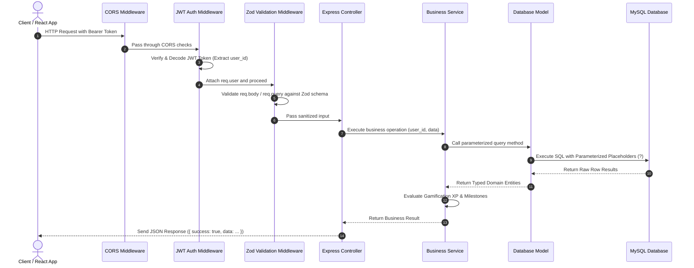
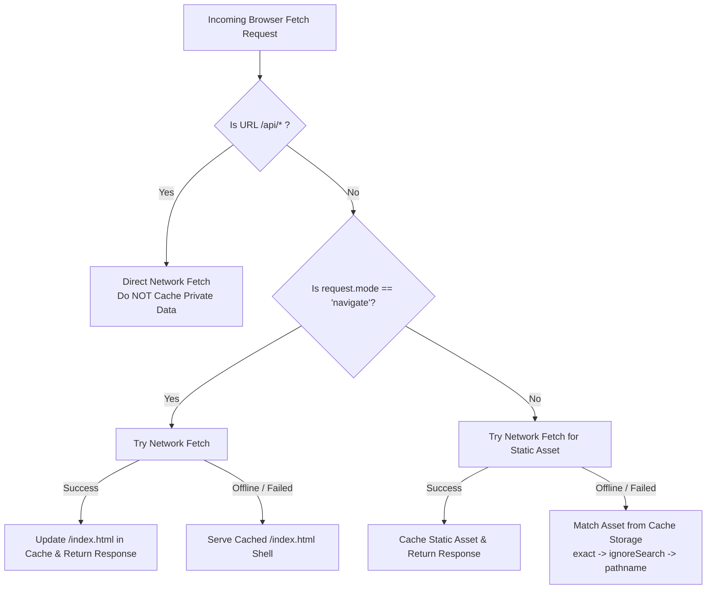
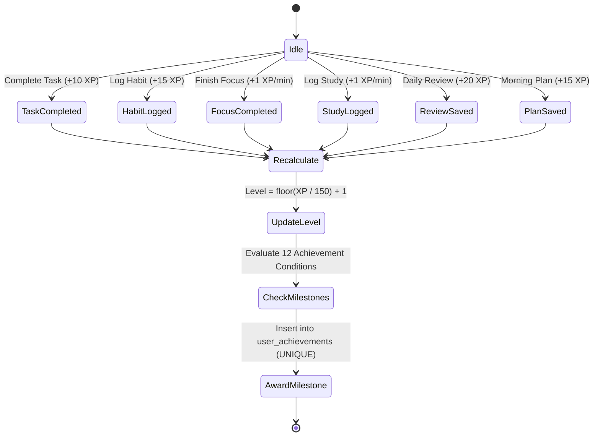

# SYSTEM ARCHITECTURE DOCUMENTATION
## Personal Productivity App (Productivity Hub)

---

### 1. Architectural Overview

The **Productivity Hub** is engineered as a **Three-Tier Modular Web Application** prioritizing separation of concerns, multi-tenant data isolation, offline resilience, and type safety across the entire stack.

```mermaid
graph TB
    subgraph ClientTier ["1. Client Presentation Tier"]
        ReactApp["React 18 SPA (Vite + TypeScript)"]
        SWLayer["Service Worker (sw.js) & Cache Storage"]
        LocalStorage["localStorage (JWT Token & Cached User Profile)"]
    end

    subgraph AppTier ["2. Application Tier (Node.js + Express)"]
        Router["Express REST Routers (/api/*)"]
        MW["Middleware (JWT Auth, Zod Validation, CORS, Error Handler)"]
        Controllers["Controllers Layer (HTTP Request/Response Handling)"]
        Services["Services Layer (Business Logic & Gamification Engine)"]
        Models["Models Layer (SQL Query Abstraction)"]
        AIEngine["AI Subsystem (Gemini / Heuristic Fallback Engine)"]
    end

    subgraph DataTier ["3. Data Tier (MySQL 8.0)"]
        MySQL[(MySQL Relational Database Engine)]
        Pool["mysql2 Connection Pool"]
    end

    ReactApp <--> SWLayer
    ReactApp <--> LocalStorage
    ReactApp -->|HTTP / REST (JSON)| MW
    MW --> Router
    Router --> Controllers
    Controllers --> Services
    Services --> AIEngine
    Services --> Models
    Models --> Pool
    Pool <--> MySQL
```

---

### 2. Client-Side Presentation Tier (Frontend)

The frontend is a Single-Page Application (SPA) built using **React 18.3**, **TypeScript 5.4**, and **Vite 5.2**, structured into distinct functional layers:

#### 2.1 State Management & Context Hierarchy
Application-wide concerns are managed using specialized React Context Providers composed in a clean hierarchical wrapper:

```mermaid
graph TD
    App[App Component]
    ThemeProvider[ThemeProvider (Dark / Light / System Theme)]
    ToastProvider[ToastProvider (Toast Notification System)]
    AuthProvider[AuthProvider (JWT Session & Current User)]
    NotificationProvider[NotificationProvider (Web Notification API)]
    BrowserRouter[BrowserRouter (React Router v6)]
    OfflineBanner[OfflineBanner (Sticky Network Status Alert)]
    Routes[Routes & ProtectedRoute Boundaries]

    App --> ThemeProvider
    ThemeProvider --> ToastProvider
    ToastProvider --> AuthProvider
    AuthProvider --> NotificationProvider
    NotificationProvider --> BrowserRouter
    BrowserRouter --> OfflineBanner
    BrowserRouter --> Routes
```

- **`AuthContext`**: Manages authentication tokens, current user profile, login, registration, and logout. Preserves cached user state during offline network disconnects to prevent session drops.
- **`ThemeContext`**: Dynamically toggles Tailwind CSS dark mode classes (`dark`) on the root document element and persists user theme preferences in `localStorage`.
- **`ToastContext`**: Provides reactive toast notifications (`success`, `error`, `info`, `warning`) with auto-dismiss timers.
- **`NotificationContext`**: Interfaces with the browser Web Notifications API, requests user permissions, and syncs notification preferences with backend endpoints.

#### 2.2 Route Protection & Layout Hierarchy
- **`ProtectedRoute`**: Inspects `AuthContext.isAuthenticated`. If the token is absent or invalid, it redirects unauthenticated users to `/login`.
- **`AppLayout`**: Renders the persistent desktop sidebar, top header, page content container, and bottom mobile navigation bar with responsive drawer menus.

---

### 3. Application Tier (Backend)

The backend is built with **Node.js** and **Express.js** using TypeScript, organized following the **Controller-Service-Model (CSM)** architectural pattern.

#### 3.1 Request Processing Pipeline



#### 3.2 Middleware Architecture
1. **`cors`**: Manages allowed cross-origin requests and headers.
2. **`auth.middleware.ts`**: Extracts `Authorization: Bearer <token>`, verifies signature with `JWT_SECRET`, decodes `userId`, and binds `req.user`.
3. **`validate.middleware.ts`**: Accepts a Zod schema, validates incoming payload, strips unexpected fields, and returns `400 Bad Request` with structured error messages upon validation failures.
4. **`error.middleware.ts`**: Centralized error handler catching unexpected exceptions and returning standard error envelopes without leaking server stack traces.

---

### 4. Database Tier (MySQL)

#### 4.1 Connection Pool Architecture
The database layer connects to MySQL using `mysql2/promise` with an optimized connection pool:
- **Max Connections**: Configurable pool limit (default 10).
- **Keep-Alive**: Active connection recycling to minimize connection overhead.
- **Parameterized SQL**: All database operations use prepared statements with positional parameters (`?`) to completely mitigate SQL Injection vulnerabilities.

#### 4.2 Multi-Tenant Data Isolation Principle
Every data entity is bound to an authenticated user through a mandatory `user_id` foreign key. All SELECT, UPDATE, and DELETE queries strictly enforce `WHERE user_id = ?`:

$$\text{Query Scope} = \text{Entity} \cap \{\text{Records} \mid \text{record.user\_id} = \text{req.user.id}\}$$

---

### 5. AI Assistant & Heuristic Fallback Subsystem

The AI subsystem provides natural language task breakdowns, daily plan suggestions, and reflection analysis.

```mermaid
graph TD
    ClientPrompt[User Prompt / Goal] --> AIController[AI Controller]
    AIController --> CheckEnv{Is AI_API_KEY set in .env?}
    CheckEnv -->|Yes| GeminiEngine[Google Generative AI Engine]
    CheckEnv -->|No| HeuristicEngine[Offline Heuristic Rule Engine]
    GeminiEngine --> ParseTasks[Parse JSON Task Suggestions]
    HeuristicEngine --> GenerateHeuristic[Generate Rule-Based Breakdown]
    ParseTasks --> ReturnSuggestions[Return Suggestions to Client]
    GenerateHeuristic --> ReturnSuggestions
    ReturnSuggestions --> ModalConfirmation[Frontend Action Confirmation Modal]
    ModalConfirmation -->|User Confirms| CreateTasks[Create Tasks in MySQL DB]
    ModalConfirmation -->|User Cancels| Discard[Discard Suggestions (0 DB Writes)]
```

---

### 6. PWA & Service Worker Caching Architecture

The Service Worker (`sw.js`) provides application shell caching and offline resilience without compromising private authenticated user data.



- **Safety Rule**: Requests targeting `/api/*` bypass the Service Worker cache completely, ensuring tokens, tasks, and private records are never persisted in unencrypted client-side cache storage.
- **Offline Shell**: Navigation requests fall back to `/index.html`, allowing the React SPA to boot offline and render cached views using `localStorage`.

---

### 7. Gamification & Deterministic XP Engine

The gamification subsystem enforces deterministic, tamper-proof progression calculated on the backend:


