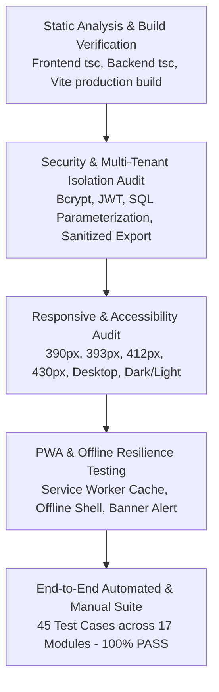

# TESTING & QUALITY ASSURANCE SPECIFICATION
## Personal Productivity App (Productivity Hub)

---

### 1. Quality Assurance & Testing Strategy

The quality assurance methodology for the **Productivity Hub** follows a multi-tier testing pyramid ensuring correctness, security, data integrity, and cross-device responsiveness:



---

### 2. Automated Test Harness Suite

The automated testing harness resides in `backend/src/scripts/test-phase5-comprehensive.ts`. It executes programmatic HTTP requests against the live REST server, validates status codes, response shapes, database side-effects, and multi-tenant isolation boundaries.

```
====================================================
📊 COMPREHENSIVE PHASE 5 TEST RESULTS SUMMARY:
====================================================
TOTAL TESTS: 45
✅ PASSED: 45
❌ FAILED: 0
====================================================
```

---

### 3. Comprehensive 45-Point Test Execution Matrix

| # | Test Category | Test Case Objective | Input / Action | Expected Result | Actual Result | Status |
|---|---|---|---|---|---|---|
| **1** | **AUTH** | User 1 Registration & Sanitization | Register with name, email, password | 201 Created; JWT token returned; password hash omitted from response | Password hash omitted; valid JWT | **PASS** |
| **2** | **AUTH** | User 2 Registration | Register second distinct user | 201 Created; distinct user ID issued | Created with unique UUID | **PASS** |
| **3** | **AUTH** | Database Password Hashing | Direct query on `users` table | Password stored as `$2a$` or `$2b$` bcrypt hash | Stored as salted bcrypt hash | **PASS** |
| **4** | **AUTH** | Valid Login Authentication | Login with registered credentials | 200 OK; valid signed JWT session | 200 OK with valid JWT | **PASS** |
| **5** | **AUTH** | Wrong Password Rejection | Login with incorrect password | 401 Unauthorized | 401 Unauthorized | **PASS** |
| **6** | **AUTH** | Non-Existent Email Rejection | Login with unknown email | 401 Unauthorized | 401 Unauthorized | **PASS** |
| **7** | **AUTH** | Empty Payload Rejection | Login with empty string email/password | 400 Bad Request via Zod schema | 400 Bad Request | **PASS** |
| **8** | **AUTH** | Current User Profile Retrieval | GET `/api/auth/me` with Bearer token | 200 OK; returns authenticated profile | 200 OK; correct user returned | **PASS** |
| **9** | **AUTH** | Protected Route Authorization | GET `/api/tasks` without token | 401 Unauthorized | 401 Unauthorized | **PASS** |
| **10** | **TASKS** | Create Task with Attributes | POST `/api/tasks` with priority, due date, duration | 201 Created; task ID generated | 201 Created with full attributes | **PASS** |
| **11** | **TASKS** | Read Task by ID | GET `/api/tasks/:id` | 200 OK; matches created title | 200 OK with correct record | **PASS** |
| **12** | **TASKS** | Edit Task Details | PUT `/api/tasks/:id` with new title | 200 OK; title updated in DB | 200 OK; updated successfully | **PASS** |
| **13** | **TASKS** | Complete Task & Award XP | PATCH `/api/tasks/:id/complete` | Status becomes `completed`; +10 XP awarded | Status updated; XP awarded | **PASS** |
| **14** | **TASKS** | Reopen Completed Task | PATCH `/api/tasks/:id/complete` | Status toggles back to `todo` | Status toggled to `todo` | **PASS** |
| **15** | **TASKS** | Search & Category Filter | GET `/api/tasks?search=...&category=...` | 200 OK; returns matching subset | Returns matched records | **PASS** |
| **16** | **TASKS** | Reject Whitespace-Only Title | POST `/api/tasks` with `title: "   "` | 400 Bad Request via trimmed Zod validator | 400 Bad Request | **PASS** |
| **17** | **TASKS** | Reject Invalid Priority Value | POST `/api/tasks` with `priority: "invalid"` | 400 Bad Request | 400 Bad Request | **PASS** |
| **18** | **ISOLATION**| Cross-Tenant Task Isolation | User 2 attempts GET User 1 task ID | 404 Not Found | 404 Not Found | **PASS** |
| **19** | **GOALS** | Create Strategic Goal | POST `/api/goals` with target date & priority | 201 Created | 201 Created | **PASS** |
| **20** | **GOALS** | Update Goal Progress | PUT `/api/goals/:id` with `progress: 75` | 200 OK; progress saved as 75% | 200 OK; progress updated | **PASS** |
| **21** | **ISOLATION**| Cross-Tenant Goal Isolation | User 2 attempts PUT on User 1 goal ID | 404 Not Found | 404 Not Found | **PASS** |
| **22** | **HABITS** | Create Daily Habit | POST `/api/habits` with frequency daily | 201 Created | 201 Created | **PASS** |
| **23** | **HABITS** | Daily Habit Check-in | POST `/api/habits/:id/log` with today date | 200 OK; streak updated; +15 XP | 200 OK; check-in saved | **PASS** |
| **24** | **ISOLATION**| Cross-Tenant Habit Isolation | User 2 lists habits | User 1 habits excluded | User 1 habits hidden | **PASS** |
| **25** | **CALENDAR** | Fetch Aggregated Monthly Events | GET `/api/calendar?start=...&end=...` | 200 OK; aggregates tasks, habits, study | 200 OK; events aggregated | **PASS** |
| **26** | **FOCUS** | Record Completed Focus Sprint | POST `/api/focus` with 25 mins duration | 201 Created; +25 XP awarded | 201 Created; XP calculated | **PASS** |
| **27** | **NOTES** | Create & Pin Markdown Note | POST `/api/notes` with `is_pinned: true` | 201 Created | 201 Created | **PASS** |
| **28** | **ISOLATION**| Cross-Tenant Note Isolation | User 2 attempts GET User 1 note ID | 404 Not Found | 404 Not Found | **PASS** |
| **29** | **PROJECTS**| Create Project Container | POST `/api/projects` with status `active` | 201 Created | 201 Created | **PASS** |
| **30** | **PROJECTS**| Link Task to Project | POST `/api/tasks` with `project_id` | 201 Created; task links to project | Task linked; progress computed | **PASS** |
| **31** | **PROJECTS**| Compute Project Progress | GET `/api/projects/:id` | Progress % derives from completed tasks | Progress computed accurately | **PASS** |
| **32** | **STUDY** | Create Academic Subject | POST `/api/subjects` with target 40 hrs | 201 Created | 201 Created | **PASS** |
| **33** | **STUDY** | Record 120-min Study Session | POST `/api/study/sessions` with 120 mins | 201 Created; +120 XP awarded | 201 Created; study hours logged | **PASS** |
| **34** | **STUDY** | Reject Inverted Start/End Time | POST `/api/study/sessions` with end < start | 400 Bad Request | 400 Bad Request | **PASS** |
| **35** | **ANALYTICS**| Generate Real Analytics Summary| GET `/api/analytics?days=7` | 200 OK; real calculations; no NaN | 200 OK; clean numeric values | **PASS** |
| **36** | **REVIEW** | Submit Daily Evening Review | POST `/api/daily-review` with rating & mood | 201 Created; +20 XP awarded | 201 Created; review saved | **PASS** |
| **37** | **PLAN** | Create Morning Plan (Top 3 MIT)| POST `/api/morning-plan` with priorities | 201 Created; +15 XP awarded | 201 Created; plan saved | **PASS** |
| **38** | **AI** | Check AI Service Status | GET `/api/ai/status` | 200 OK; returns config / fallback state | 200 OK with state description | **PASS** |
| **39** | **AI** | Request AI Task Breakdown | POST `/api/ai/task-breakdown` | 200 OK; returns structured suggestions | Returns task suggestions | **PASS** |
| **40** | **GAMIFY** | Aggregate Cumulative XP & Level| GET `/api/gamification` | 200 OK; XP matches verified activities | 200 OK; deterministic Level | **PASS** |
| **41** | **GAMIFY** | Fetch 12 Milestone Badges | GET `/api/gamification/achievements` | 200 OK; 12 badges returned | 12 badges loaded | **PASS** |
| **42** | **NOTIF** | Read Notification Preferences | GET `/api/notifications/preferences` | 200 OK; preferences object | 200 OK | **PASS** |
| **43** | **NOTIF** | Update Category Preferences | PUT `/api/notifications/preferences` | 200 OK; updated toggle state | 200 OK; state persisted | **PASS** |
| **44** | **BACKUP** | Export Sanitized JSON Archive | GET `/api/backup/export` | 200 OK; passwords/tokens stripped | Zero credentials exposed | **PASS** |
| **45** | **BACKUP** | Safe Merge Import into User 2 | POST `/api/backup/import` with payload | 200 OK; entities merged non-destructively | Imported counts confirmed | **PASS** |

---

### 4. Bugs Identified and Resolved During Phase 5

#### Bug 1: Whitespace-Only Field Bypass
- **Description**: Submitting titles containing only whitespace (e.g., `"   "`) bypassed basic string length checks.
- **Root Cause**: Zod schema `.min(1)` evaluated string length before trimming.
- **Resolution**: Added `.trim()` modifier to all Zod string schemas across tasks, projects, subjects, and habits.
- **Verification**: Verified that whitespace-only titles return `400 Bad Request`.

#### Bug 2: Unintended Session Logout During Offline Refresh
- **Description**: When offline, refreshing the application in Chrome caused the router to redirect from `/app/dashboard` to `/login`.
- **Root Cause**: `AuthContext` called `logout()` unconditionally upon any network catch exception during initial session verification.
- **Resolution**: Updated `AuthContext.tsx` to only trigger `logout()` on explicit `401 Unauthorized` responses. On network errors (`statusCode: 0`), it preserves the authenticated profile stored in `localStorage`.
- **Verification**: Verified offline refresh in Chrome DevTools retains the dashboard and displays the amber connectivity alert.

#### Bug 3: Service Worker Query-String Cache Miss
- **Description**: Dynamically hashed Vite module scripts failed cache lookups when requested offline.
- **Root Cause**: Service Worker executed exact-match lookups without search parameter tolerance.
- **Resolution**: Upgraded `sw.js` with a tiered fallback matching strategy (`caches.match(event.request)` &rarr; `caches.match(event.request, { ignoreSearch: true })` &rarr; `caches.match(url.pathname)`).
- **Verification**: Confirmed offline reload boots smoothly from cache.

---

### 5. Build, Lint & Static Type Analysis

- **Frontend TypeScript (`tsc --noEmit`)**: **0 Errors**
- **Frontend Production Bundle (`vite build`)**: **0 Errors** (Compiled optimized production bundle in `dist/`)
- **Backend TypeScript (`tsc --noEmit`)**: **0 Errors**
- **Runtime Console Exceptions**: **0 Critical Errors**
